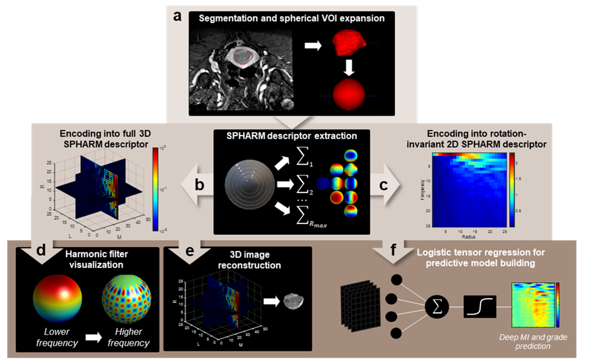

# 3Dspharm-decomposition-tumor

This repository contains the 3D spherical harmonics (SPHARM) decomposition and machine learning code associated with a study by Lefebvre et al. currently under review (Lefebvre et al. Predicting histopathology markers of endometrial carcinoma using a novel quantitative image analysis approach based on spherical harmonics in multiparametric MRI. 2022).  

This work is largerly based on contributions and MATLAB packages developed by others and reported previously, mainly:
* `NFFT - Nonequispaced FFT` (Keiner et al. Using NFFT 3 - a software library for various nonequispaced fast Fourier transforms. ACM Trans Math Software. 2009. 36, Article 19, 1-30.)
* `TensorReg` (Zhou and Li. Regularized matrix regression. Journal of Royal Statistical Society Series B. 2013. 76(2):463-483.)

